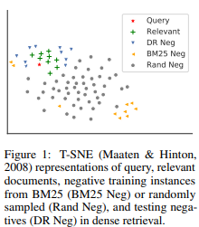

# (ANCE) Approximate Nearest Neighbor Negative Contrastive Learning for Dense Text Retrieval

Created: 2025년 10월 4일 오전 12:00

# 한줄요약

ANCE : retriever의 한 종류. 근데 negative를 뽑을 때 in-batch에서 뽑는 게 아니라 global에서 ANN으로 꽤나 유사도가 높은 것들 위주로 hard negative를 샘플링함. 이때 trainer랑 inferencer를 병렬적으로 둬서 특정 시점마다 ANN 인덱스 갱신. BM25나 DPR 보다 성능이 좋았음. 정확도는 ColBERT가 더 높고 빠른 건 ANCE.

ANCE에서 사용된 hard negative 샘플링 아이디어를 ColBERT 등 기타 모델에도 적용 가능할듯.

# Abstract

텍스트 검색을 dense representation 공간에서 수행하는 것 → good

근데 end-to-end 방식으로 학습된 dense retrieval(DR)이 sparse retrieval보다 성능이 낮을 때가 있음.

→ uninformative negative들 때문이다. (이 논문의 주장)

→ ANCE (Approximate Nearest Neighbor Negative Contrastive Learning) 학습 매커니즘 제안.

ANN(근사 최근접 탐색)을 활용해서 전체 코퍼스에서 hard negative를 선택하는 방식.

→ ANCE retrieval은 BERT 기반의 cascade IR 파이프라인(Retriever → Re-ranker 구조(계단식 구조))과 거의 동일한 정확도, 100배 더 효율적.

# Introduction

DR은 여러 장점을 가짐: fully learnable representation, 사전학습과의 용이한 통합, ANN 기반 효율적인 검색 지원. (DPR이 DR의 한 종류.)

DR이 마주해야할 negative는 relevant 주위에 있음. 이걸 잘 구분해야함. 근데 실제로 기존 학습에서는 BM25나 rand negative만 쓰니까 제대로 학습이 안 됨.

(원래는 in-batch local negative로 contrastive learning을 했었는데 이게 hard negative가 아니라서 학습 효율이 별로임.)

→ ANCE 제안 : **random이나 in-batch negative 대신, 현재 학습 중인 DR 모델을 사용해 전체 코퍼스에서 global negative를 추출.**

→ 이렇게 하면 train 중 negative 분포와 테스트 시 실제 irrelevant 문서 분포가 근본적으로 일치하도록 맞출 수 있음.

이 논문에서는 이런 과정을 분산 감소 이론 관점에서 설명. (ANCE가 뽑은 negative의 gradient norm이 local negative보다 훨씬 크다. → 학습 잘됨.)

ANCE가 일반 웹 겁색, 상업적 검색 엔진 retrieval 시스템, **OpenQA에 효과적임을 보임.**

# Analyses on the convergence of DR training

이론적인 부분. 지피티 요약 :

1. Convergence Rate & Gradient Norm
    - SGD 수렴 속도는 샘플마다 나오는 gradient norm의 크기와 분산에 달려 있음.
    - 좋은 negative는 gradient norm이 커서 학습 신호가 강하고, 나쁜 negative는 gradient norm이 0에 가까워서 학습에 거의 기여 안 함.
2. Diminishing Gradients of Uninformative Negatives
    - Easy negative(쿼리랑 너무 멀리 떨어진 문서)는 loss가 거의 0 → gradient도 0 → 학습에 쓸모 없음.
    - 그래서 in-batch random negative로는 학습이 느리고 불안정함.
3. Inefficacy of Local In-Batch Negatives
    - 배치 크기 b는 코퍼스 크기 |C| 에 비해 매우 작음.
    - 진짜 hard negative(구분하기 어려운 문서)는 코퍼스 전체에서 아주 소수.
    - 따라서 random mini-batch 안에 hard negative가 들어올 확률은 거의 0 → in-batch negative는 정보성 부족.

# Approximate nearest neighbor noise contrastive esetimation

목표 : hard negative를 코퍼스 전체에서 선택하자. 

→ ANCE : ANN으로 현재 DR 모델을 사용해서 문서 검색 → 상위 문서 중 positive 제외 → 나머지가 ANCE negative.

- 모델이 학습 중일 때 코퍼스 임베딩도 바뀌니까 ANN 인덱스도 갱신 필요.
- 근데 매 배치마다 전부 새로 인코딩은 불가능 → 비동기 방식 (inferencer + trainer 분리) (Fig. 2)
- → GPU를 1:1로 나누면 최적으로 병렬적으로 돌릴 수 있다고 함.

파라미터는 다음과 같은 손실 함수를 최소화 :

$D^{-}_{\text{ANCE}} = \text{ANN}_{f(q,d)} \setminus D^{+}$ (ANN 검색 결과 중 positive 제외)

$\text{ANN}_{f(q,d)}$ : ANN 인덱스를 통해 f()로 검색된 상위 문서 집합.

f() : DR 모델

(사실상 원래 손실함수에서 negative 부분만 바꾼 것.)

손실함수 l은 보통 NLL 사용. (negative log likelihood)

$$
l(f(q, d^{+}), f(q, d^{-})) = - \log \frac{\exp(f(q, d^{+}))}{\exp(f(q, d^{+})) + \sum_{d^{-}} \exp(f(q, d^{-}))}
$$

# Experimental methodologies

- BM25 warm up : BM25 negative로 먼저 warm-up 후 ANCE로 넘어감
- DR 모델 : OpenQA 태스크에서는 DPR 체크포인트를 초깃값으로 학습 시작.
- 긴 문서를 BERT-Siamese(=Bi-encoder)에 맞추기 위해 FirstP, MaxP 사용. (FirstP : 문서의 첫 512토큰만 사용, MaxP : 문서를 512토큰 단위 (최대4개)로 쪼개서 각각 스코어를 계산한 뒤 max-poling) - document retrieval에 필요한거라 passage에서는 고려할 필요 없을듯.
- ANN 검색에는 Faiss IndexFlatIP 활용.
- Trainer와 inferencer에 GPU 1:1 배분.
- 10000배치마다 인덱스 갱신. batch size = 8, gradient accumulation step = 2, 4개의 GPU사용.
- 각 positive에 대해 ANN top-200에서 negative를 균일하게 하나 샘플링.

# Evaluation results

→ ANCE가 BM25, DPR 등보다 좋다. cross-encoder reranker 대비 100배 빠르다. (ANCE는 retriever지만 NDCG 봤을 때 reranker 발밑까진 따라왔다. 근데 reranker보다 훨씬 빠르다. 라는 걸 말하고 싶은듯.)

→ **reranker 그대로 두고 retriever만 DPR → ANCE로 바꿔도 성능이 오른다.**

- 코사인 유사도, BCE/hinge loss도 실험해봤는데 그닥 안 좋았음. → **NLL이 최고**