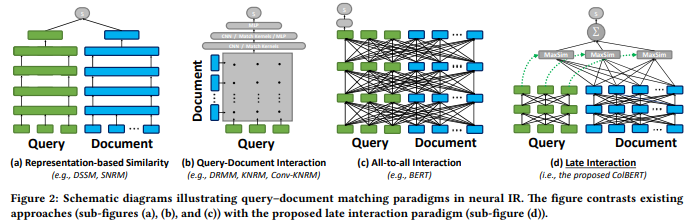

# ColBERT: Efficient and Effective Passage Search via Contextualized Late Interaction over BERT

Created: 2025년 10월 2일 오후 10:07

# 한줄요약

ColBERT : contextualized late interaction 방식을 사용해 효율적인 검색을 가능하게 하는 모델.

query와 document를 독립적으로 인코딩해 얻은 representation에서 MaxSim 연산을 통해 상호작용시킴으로써 유사도 측정.

Re-ranker로 쓸 수도 있고, FAISS 등을 사용하면 retriever로도 사용 가능 → end-to-end neural retrieval 수행 가능.

retriever로서는 BM25보다 매우 우수한 성능, 찾아보니까 DPR 보다도 성능이 좋음.

re-ranker로서는 BERT와 비슷한 성능(아주 약간 낮긴 함), 대신 170배 빠른 연산. 

ColBERTv2, ColBERT-QA 라는 것도 있음.

ColBERT-QA : ColBERT를 QA 태스크에 적용한 것. weak supervision 개념 추가

weak supervision : 자신의 retrieval 결과를 pseudo-label로 재사용하여 iterative self-training 수행.

ColBERTv2 : ColBERT-QA 보다 QA task에서도 성능이 더 좋다고 함. 뭔가 여러 개 바꾼 듯…

# Abstract

ColBERT : late interaction 아키텍쳐 도입. → query와 document를 BERT로 각각 독립적으로 인코딩한 뒤, 저비용이지만 강력한 상호작용 단계를 통해 세밀한 유사도 모델링.

(Retriever와 Re-ranker의 중간 느낌?)

BERT 수준의 성능을 유지하면서도 100배 빠른 검색, 10000배 적은 연산량 달성.

‘Maxsim’ 연산.

# Model(ColBERT)

ColBERT는 뉴럴 IR에서 품질과 비용을 균형있게 맞추기 위한 프레임워크를 제시. BERT 같은 심층 언어 모델 대상.

→ **re-ranker로만 쓸 수도 있고 end-to-end retrieval을 할 수도 있다.**

Query와 document를 각각 BERT encoder에 입력해서 인코딩.

→ late interaction 방식으로 q와 d 사이의 relevance score 계산. (score : MaxSim 연산들의 합.)

**MaxSim :**

$$
S(q, d) = \sum_{i=1}^{m} \max_{1 \leq j \leq n} \; \text{sim}(e_{q_i}, e_{d_j})
$$

sim()은 보통 cosine similarity. (또는 L2 distance)

**query의 각 임베딩 벡터에 대해 document의 모든 벡터와 cosine similarity를 구하고, 그 중 최댓값을 취함. 이후 이 최댓값들을 합산.**

직관적으로 보면, query의 각 단어를, 그 단어의 맥락을 반영한 임베딩을 사용해 document 임베딩 집합에서 “소프트하게 검색”하는 과정. 그리고 query의 각 단어와 document 내 단어 사이의 가장 높은 유사도 점수를 통해 “매칭 강도”를 측정. 이 매칭 점수들을 모두 합산해서 문서 전체의 관련성을 추정.

MaxSim의 장점:

1. 계산 비용이 저렴한 상호작용 매커니즘.
2. top-k retrieval 시 매우 효율적인 pruning이 가능. ( 덜 중요한 문서들을 미리 잘라낼 수 있다. )

(FAISS를 사용하면 특정 query 토큰과 가장 유사한 문서 임베딩 토큰들을 바로 찾아줄 수 있음. 이때 모든 문서 토큰을 다 훑는 게 아니라 근사 최근접 탐색(ANN)을 사용해서 빠르게 상위 k개 토큰만 뽑음. 그 토큰들이 뽑힌 문서만 보면 됨. → 덜 중요한 문서는 애초에 버릴 수 있으므로 pruning이 용이하다고 표현.)

### Query Encoder

query와 document를 각각 bag of embeddings로 인코딩. 이때 BERT encoder를 사용.

query, document가 같은 BERT 모델을 공유하지만, 입력이 query인지 document인지 구분하기 위해 query 앞에는 특별 토큰 [Q]를, document 앞에는 [D]를 붙임. ([CLS] 토큰 바로 뒤)

query 길이가 짧으면 [mask]로 패딩. 

각 토큰의 BERT representation이 나오면 인코더는 그것을 활성화함수 없는 선형 레이어에 통과시킴.(ColBERT 임베딩의 차원을 조절하는 역할을 함. → m차원 임베딩 생성.) (일반적으로 m은 BERT의 고정된 hidden dim(768)보다 훨씬 작게 설정.) (저장 공간을 줄이는 데 매우 중요)

이후 출력 임베딩은 L2 norm = 1로 정규화. → 이러면 내적이 곧 cosine similarity가 됨.

### Document Encoder

query encoder 와 유사함.

특수토큰 [D] 사용. [mask] 패딩 사용 x

구두점에 해당하는 임베딩 제거. (불필요)

 

### Late Interaction

$$
S_{q,d} = \sum_{i \in [|E_q|]} \max_{j \in [|E_d|]} \; \mathbf{E}_{q_i} \cdot \mathbf{E}_{d_j}^{T}
$$

(정규화했으므로 내적 = 코사인유사도)

→ end-to-end 미분가능. BERT 인코더는 파인튜닝하고 선형 레이어, [Q],[D] 임베딩들은 처음부터 학습.

→ 학습 방식 정리. <q, 정답문서, 오답문서> 삼중쌍 데이터 사용.

### Offline Indexing

query-document 계산을 분리했기 때문에, 문서 임베딩을 미리 오프라인에서 계산해둘 수 있음.

이때 BucketIterator(length-based bucketing) 사용 : 길이가 비슷한 문서들끼리 배치로 묶어서 패딩 낭비를 최소화함.

### Top-k Re-ranking with ColBERT

Retriever가 뽑아낸 문서들을 re-ranking. 이땐 pruning 없이 모든 문서 평가.

(뒤에 뭔가 자세히 설명하긴 하는데 … 모델 구조 그림 그대로인듯 그냥.)

일반적인 BERT 기반 re-ranker보다 계산량 매우 낮음.

원래는 |q| + |d_i| 길이의 입력을 문서 개수만큼 BERT에 넣어야 함. 그리고 여기서 attention 연산은 입력 길이에 대해 제곱 복잡도를 가짐.

반면 ColBERT는 BERT에 단 한 번, |q| 길이 만큼의 훨씬 짧은 입력을 넣으면 끝.

### End-to-end Top-k Retrieval with ColBERT

ColBERT로 tok-k 문서를 직접 retrieval.

위에서 말했던대로 FAISS 사용하여 pruning. (필요없는 문서 빠르게 거름.)

여기서도 근사 검색 - 정밀 평가로 총 2단계로 나눠서 검색.

1단계에서 FAISS로 빠르게 K개의 문서를 얻음.

2단계에서 이 K개의 문서만 대상으로 위에서 설명했던 방식대로 re-ranking 수행.

# Experimental evaluation

1. Re-ranking : BERT와 비슷한 성능 + 매우 빠른 속도. (근데 BERT가 성능이 조금 더 좋긴 한듯..?)
2. End-to-End(그 중에서도 retriever 성능) : BM25등보다 recall 높음. 
    
    (찾아보니까 DPR 보다도 성능이 조금 좋다고 함. DPR은 한 벡터로 문서를 대표하니까 정보가 많이 압축될 수 있기 때문. 하지만 메모리 많이 차지하고 FAISS, IVFPQ 같은 걸 써야함. (ANN 최적화 필요.))