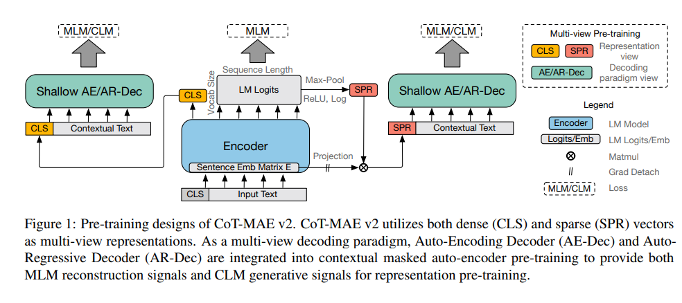

# CoT-MAE v2: Contextual Masked Auto-Encoder with Multi-view Modeling for Passage Retrieval

Created: 2025년 10월 5일 오전 10:13

# 한줄요약

CoT-MAE v2 : multi-view representation(dense, sparse) & decoding(AR, AE)을 결합한 **retriever 사전학습 방법.** 또는 그런 사전학습 방법으로 만들어진 retriever 모델.

히브리어 태스크에 쓰려면?

1. **Backbone:** DictaBERT 또는 HeBERT 처럼 히브리어 PLM 사용
2. **Pre-training:** CoT-MAE v2 loss 구조 적용 (AE + AR decoder)
3. **Fine-tuning:** 히브리어 Semantic Retrieval dataset 에 bi-encoder 형태로 학습
4. **Inference:** Dense → FAISS / Sparse → Top-k PyTorch sparse dot product

# Abstract

retrieval의 성능을 향상시키기 위한 기술 중 하나로 contextual masked auto-encoder가 있었음. 문맥 임베딩을 활용해서 문서 복원을 돕는 역할.

여기서 더 확장해서 multi-view modeling 개념을 도입함.

multi view representation은 dense 벡터와 sparse 벡터를 동시에 활용하여 문장의 의미를 다양한 관점에서 포착.

multi-view decoding 패러다임은 auto-encoding decoder와 auto-regressive decoder를 모두 사용해 더 나은 문맥 표현 학습을 가능하게 함.

→ CoT-MAE v2 라고 명명.

대규모 검색, 도메인 외 zero-shot 환경에서도 좋은 성능 보임.

# Introduction

최근 연구에서는 retrieval에서 사전학습 언어모델(PLM)을 활용함.

PLM으로 sparse retrieval 및 dense retrieval을 각각 개선 가능.

최근 연구들:

[sparse]

SPLADE : PLM 활용해 sparse 벡터 생성 + contrastive loss로 학습

LexMAE : masked auto-encoder 구조 도입 ⇒ 어휘 단위의 중요도를 bottleneck으로 학습.

[dense]

contextual-supervised learning과 같은 보조 학습을 사전학습 단계에 추가.

CoT-MAE : contextual masked auto-encoding (하나의 문서에서 두 개의 문단을 선택해 서로의 문맥(context)을 활용함으로써 문맥 정보를 바탕으로 더 나은 표현을 학습하도록 함.

→ CoT-MAE v2 아이디어 : CoT-MAE + sparse pretraining.

한 모델이 두 표현(sparse, dense) 표현을 동시에 학습하도록 설계.

또한 auto-encoding decoder, auto-regressive decoder를 pre-training에서 함께 사용 (AE-Dec : 입력 재구성에 초점, MLM / AR-Dec : 다음 단어 생성에 초점, CLM (Causal Language Modeling))

대규모 웹 검색 벤치마크 MS-MAROC passage ranking, TREC deep learning track 2019, TREC DL track 2020에서 실험 수행. & 도메인 외 데이터셋에 대해서도 성능 평가 진행. → SOTA

# Approach

input : query 또는 passage 하나

### Multi-view representations

Dense vector : [CLS]. 문장 또는 문단 수준의 의미를 자연스럽게 표현.

Sparse vector : 각 토큰 위치 별 logit을 빈도로 해석한 것. 마지막 층의 hidden state를 logit space로 투영.

각 단어 j에 대해 모든 토큰 위치 i 중에서 가장 높은 logit 값을 선택하는 max-pooling 수행.

질의(q)와 문단(p) 간의 유사도는 다음과 같이 계산.

(sparse vector는 top-k함수를 적용하여 백터 내 상위 k개의 값만 남김. → 저장 공간 줄임.)

### Contextual Masked Auto-encoder with Multi-view Decoding Paradigm

기존 BERT처럼 MLM 목표 사용.

decoder 쪽에는 두 개의 transformer (AE-Dec, AR-Dec)를 사용하여 dense 및 sparse 벡터 모두에 대해 multi-view 사전학습 신호를 제공.

Dense : dense vector + contextual sentence embedding을 concat하여 decoder의 입력으로 사용.

Sparse : sparse vector를 hidden size 차원(768)으로 투영하고, contextual sentence embedding과 concat 하여 디코더 입력으로 사용.

contextual sentence embedding : 이웃한 passage의 encoder 출력 임베딩(보통 전/후 중 하나 선택해서 사용)

디코더 입력은 두 가지 형태의 시퀀스로 구분, (각각 AE-Dec, AR-Dec)

AE-Dec : MLM 재구성 신호를 학습.

L_ae-dec : 마스킹된 위치 i의 단어 t_i를 decoder가 복원하도록 CE loss를 최적화.

AR-Dec : CLM(Causal Language Modeling) 생성 신호를 학습.

L_ar-dec : 토큰 t_i 다음에 나올 t_i+1을 예측하도록 학습.

### Fine-tuning and Inference

파인튜닝 시에는 DPR과 동일한 형태의 loss 사용.

이때는 decoder 없이 encoder만 남음. bi-encoder 구조로 query와 passage는 각각 encoder를 거쳐 DEN, SPR을 내놓음.

top-k sparse vector만 사용해 효윻성 유지.

regularization 위해 SPLADE식 FLOPs penalty 추가.

d는 앞서 정의한 유사도 그대로 적용.

파인튜닝 파이프라인:

BM25 negatives → Hard negatives → Re-ranker → retriever-distill(re-ranker의 분포를 retriever에 전달해줌.)

re-ranker는 여기서는 이미 fine-tuned된 BERT-based re-ranker 사용. (이렇게 되면 결국 re-ranker는 학습 없이 고정됨. teacher 역할만 수행.)

→ 4단계 distill 과정

추론 시에는 query, passage 각각 encoder에 통과시켜서 dense vector, sparse vector 얻음 → 위와 같은 방식으로 유사도 계산.

dense retrieval : FAISS 라이브러리로 수행.

sparse retrieval : PyTorch의 Sparse Matrix 곱셈 연산으로 수행.

# Experimental Settings

- 자세한 세팅
    
    ### 1️⃣ **Datasets**
    
    - **Training / Fine-tuning:**
        - **MS MARCO Passage Ranking** (Nguyen et al., 2016)
            
            → 500 K queries + 8.8 M passages
            
            → Positive / Negative pairs : human-labeled positives + BM25 negatives
            
    - **Evaluation:**
        - **MS MARCO Dev**
        - **TREC DL 2019 & 2020**
        - **BEIR benchmark (Thakur et al., 2021)**
            
            → 여러 도메인 (out-of-domain) 테스트셋 으로 zero-shot 평가
            
    
    ---
    
    ### 2️⃣ **Pre-training Configuration**
    
    - **Backbone:** BERT-base (12 layers, 768 dim, 12 heads)
    - **Tokenizer:** WordPiece (vocab = 30 522)
    - **Batch size:** ≈ 1024 sequences
    - **Learning rate:** 1 × 10⁻⁴ (AdamW)
    - **Warm-up ratio:** 10 %
    - **Total steps:** 100 K
    - **Mask ratio:** ≈ 15 % (Masked tokens)
    - **Context window:** 이웃 passage 두 개 사용 (앞/뒤 각 1)
    - **Decoders:** AE-Dec + AR-Dec (동시에 학습)
    - **Loss:** Ltotal=Lenc+Lae−dec+Lar−decL_{total} = L_{enc} + L_{ae-dec} + L_{ar-dec}Ltotal=Lenc+Lae−dec+Lar−dec
    
    ---
    
    ### 3️⃣ **Fine-tuning / Distillation**
    
    - **Loss:** contrastive InfoNCE + (optional) KL distillation loss
    - **Temperature τ:** 1.0
    - **Negatives:** BM25 (1단계) → hard negatives (2단계)
    - **Distillation teacher:** CoT-MAE re-ranker (cross-encoder BERT)
    - **Optimizer:** AdamW (lr = 2 × 10⁻⁵)
    - **Batch size:** ≈ 256 triplets (q, p⁺, p⁻)
    - **FLOPs regularization:** SPLADE 공식 그대로 적용
    - **Top-k sparsity:** k ≈ 768 유지
    
    ---
    
    ### 4️⃣ **Inference / Retrieval**
    
    - **Dense retrieval:** FAISS (Inner product search)
    - **Sparse retrieval:** PyTorch sparse matrix dot-product
    - **Similarity:** d(q,p)=DENq⋅DENp+SPRq⋅SPRpd(q,p) = DEN_q·DEN_p + SPR_q·SPR_pd(q,p)=DENq⋅DENp+SPRq⋅SPRp
    - **Evaluation metric:** MRR@10, nDCG@10/20, Recall@1k
    
    ---
    
    ### 5️⃣ **Hardware**
    
    - 8 × NVIDIA A100 GPUs (80 GB)
    - Training time ≈ 2 days (pre-train) + 1 day (fine-tune)

데이터셋이 500k queries + 8.8M passages임. → 히브리어 태스크에 비해 매우 큼 ..

# Experiment results

→ 성능 good

이밖에 out-domain zero-shot 성능도 좋았음.
