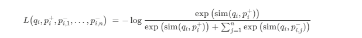

# Dense Passage Retrieval for Open-Domain Question Answering

Created: 2025년 10월 2일 오전 10:32

# 한줄요약

복잡한 사전학습이나 교차 인코더 없이도 단순한 dual-encoder 구조와 올바른 학습 전략만으로 sparse 기반(BM25)을 능가하는 dense passage retrieval을 제안해, open-domain QA에서 새로운 SOTA를 달성했음을 보여줌.

“Simple + Proper Training > Complex Models”

# Abstract

open domain QA는 효율적인 passage retrieval을 사용하는데, 전통적으로 TF-IDF나 BM25같은 sparse vector space model이 사용되어 왔음.

이 연구에서는 retrieval을 오직 dense representation만으로도 실질적으로 구현할 수 있음을 보임.

→ Lucene-BM25를 top-20 passage retrieval 정확도 기준으로 9%~19%p 능가. & 여러 open domain QA 벤치마크에서 SOTA 달성.

# Introduction

현재 QA 시스템의 2단계 프레임:

1. context retriever : 질문의 답이 포함된 소수의 passage 집합을 선택
2. machine reader가 검색된 문맥을 정밀하게 분석하여 정답을 식별.

하지만 성능이 별로인 경우가 많으며, retrieval 단계의 개선 필요성을 보여줌.

기존엔 TF-IDF, BM25같은 sparse vector space model 사용.

→ dense retrieval 시스템이 더 잘 할 수 있다. (e.g. ‘bad guy’와 ‘villain’을 더 잘 매칭할 수 있음.)

(sparse : 단어 기반 검색 / dense : 의미 기반 임베딩 검색)

ORQA가 실제로 dense retrieval으로 BM25 능가. 하지만 2가지 단점 가짐.

1. ICT pretraining은 계산량이 크고, ‘문장 → 질문 대체’ 가설이 불확실. (ICT : Inverse Cloze Task. 문서에서 한 문장을 가려놓고 그 문장을 포함한 블록을 맞히는 pretraining 방식. (일반 문장을 질문 대용으로 사용))
2. context encoder가 QA 쌍으로 fine-tuning 되지 않아 최적이 아님.

→ DPR의 차별점 : ORQA처럼 복잡한 사전학습 없이, 단순히 QA 쌍만으로 dense retriever를 학습

pretrained BERT와 dual-encoder 구조 활용.

임베딩 학습 시 동일 배치 내의 모든 question-passage 쌍을 비교하면서 question과 passage 벡터의 내적을 최대화하는 방식으로 최적화.

→ BM25, ORQA 크게 능가.

# Model(DPR: Dense Passage Retriever)

DPR의 목표 : 모든 passage를 low-dimensional continuous space에 임베딩해서 인덱싱.

→ run-time 시에 상위 k개의 passage를 효율적으로 검색 가능.

### Overview

DPR에서 질문과 passage 간 유사도는 두 encoder 출력 벡터의 내적으로 정의.

$\text{sim}(q, p) = E_Q(q)^{\top} E_P(p)$

- $E_Q(q)$: Question encoder가 출력한 질문 벡터
- $E_P(p)$: Passage encoder가 출력한 passage 벡터
- 결과값이 클수록 질문–passage 간 유사도가 높다고 판단.

Encoders : 두 개의 독립적인 BERT 사용. [CLS] 토큰의 표현을 출력으로 사용. d=768.

Inference : 

모든 passage에 passge encoder E_P를 적용하고, 그 결과를 FAISS를 이용해 오프라인으로 인덱싱.

(FAISS : dense vector 유사도 검색 및 클러스터링을 위한 오픈소스 라이브러리.)

run-time에서 질문 q가 주어지면, question encoder E_Q를 통해 임베딩 v_q = E_Q(q)를 얻고, 이와 가장 가까운 임베딩을 가진 상위 k개의 passage 검색. 

### Training

목표: 더 나은 embedding function을 학습하여, 관련 있는 question-passage 쌍은 거리가 가깝게, 관련 없는 쌍은 멀게 만드는 벡터 공간을 구축하는 것.

학습데이터 
$$D=
\{
\langle q_i, p_i^{+}, p_{i,1}^{-}, \dots, p_{i,n}^{-} \rangle
\}_{i=1}^m
$$

q_i : 질문

p_i^+ : 하나의 관련있는 passage

p_i,j^- : n개의 관련없는 passage

Retriever loss funcion:

다음과 같은 positive passage에 대한 negative log likelihood를 최소화하는 게 목표.

negative passage들은 3가지 유형을 고려함.

1. random : 코퍼스에서 무작위로 고른 passage
2. BM25 : BM25로 검색된 passage 중 답은 없지만 질문 토큰 대부분을 매칭하는 passage
3. Gold : 학습 세트에서 다른 질문과 연결된 positive passage

논문의 최적 모델은 같은 미니배치 안의 gold passages와 BM25 negative passage 하나 사용.

(gold passage들을 negative로 재사용하면 계산 효율성을 높이면서도 좋은 성능 얻을 수 있음.)

# Experiments: Question Answering

(여기선 passage 안에서도 답변이 되는 문장을 선택함. 그 방법론을 설명한 것.)

여기서 P_i들은 query와 passage를 concat해서 cross-attention 구조의 BERT에 넣어서 나온 출력.

학습 목표는 positive passage 내 모든 올바른 답변 span의 marginal log-likelihood(답 문자열이 passage 내 여러 번 등장할 수 있음)와, positive passage가 선택될 log-likelihood를 동시에 최대화하는 것.

Retriever 와 reranker는 학습 별도로 진행.

# Conclusion

dense retrieval이 오픈 도메인 QA에서 기존의 sparse retrievel 컴포넌트를 능가함.

단순한 dual-encoder 접근법이 잘 작동함을 보임. 

실험적 분석과 ablation study를 통해, 더 복잡한 모델 구조나 유사도 함수가 반드시 추가적인 이점을 주는 것은 아님을 보임. (cross-attention 기반 retriever, multi-layer interaction 모델 등은 계산량이 너무 많음. 단순 dual-encoder 구조로도 충분히 높은 성능을 달성.

오히려 in-batch negatives 의 방법 등이 성능 향상에 더 도움됨.

SOTA 달성.
