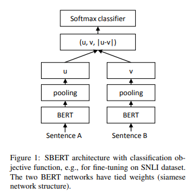

# Sentence-BERT: Sentence Embeddings using Siamese BERT-Networks

Created: 2025년 10월 2일 오전 10:42

# 한줄요약

원래 BERT는 문장 A와 B를 같이 넣어줘야 해서 10000개의 문장에 대한 유사도를 구하려면 10000C2 번이나 계산해야 했음 → **문장별로 따로 BERT를 태운 뒤에 pooling layer를 거쳐 나온 벡터끼리 코사인 유사도 등으로 유사도를 구함. (SBERT)**

bi-encoder retriever 기본형. (두 인코더 가중치 공유)

# Abstract

BERT와 RoBERTa는 의미적 문장 유사성같은 sentence-pair regression task에서 SOTA 달성했음.

하지만 두 문장을 모두 네트워크에 입력해야 해서 계산 비용이 너무 높음.

→ 본 논문에서는 사전학습된 BERT를 수정하여 siamese와 triplet network 구조를 사용해 의미적으로 유의미한 문장 임베딩을 생성하고, 이를 코사인 유사도로 비교할 수 있는 Sentence-BERT를 제안함.

→ 기존 BERT/RoBERTa로 65시간 걸리던 유사 문장 쌍 검색을 약 5초로 줄여주면서도 정확도를 유지함. SBERT와 SRoBERTa를 일반적인 STS과제와 전이학습 과제에서 평가했으며, 다른 최신 문장 임베딩 기법들을 능가하는 성능을 확인.

siamese : 샴 쌍둥이의 그 siamese. 두 개(혹은 그 이상)의 입력을 같은 신경망 구조와 파라미터를 공유해서 인코딩.

→ 유사도 검색에 적합.

# Model

BERT/RoBERTa 위에 pooling 레이어를 추가하여 문장을 고정 길이 벡터로 변환. 기본값은 mean pooling layer.

BERT/RoBERTa를 파인튜닝하기 위해 siamese과 triplet network를 사용하여 가중치 학습.

네트워크 구조는 사용 가능한 학습 데이터에 따라 달라짐.

다음 3개의 목적 함수를 실험:

1. Classification objective function

W_t shape : (3n x k) 

(n : 문장 임베딩 차원 / k : label 개수)

1. Regression Objective Function

1. Triplet Objective Function

앵커 문장 a, 긍정 문장 p, 부정 문장 n이 주어졌을 때, triplet loss는 a와 p의 거리가 a와 n의 거리보다 작도록 학습시킴.

